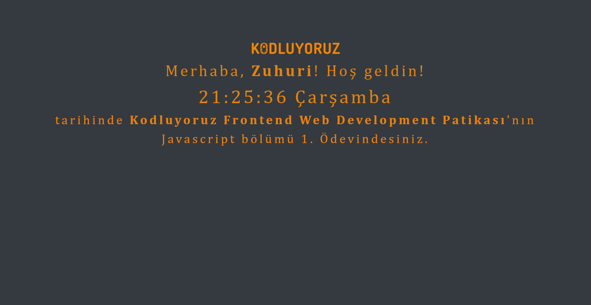

# Patika.dev - Javascript Saat ve Karşılama
Sizden girişte isminizi isteyip sonra bu ismi karşılama ekranına yerleştirerek o anki saati ve günü gösteren bir ekran.

## Date Kullanımı
- getDay(): Geçerli tarihteki haftanın gün değerini döndürür (0-6: 0:Pazar,....,6:Cumartesi)
- getHours(): Geçerli tarihteki saat değerini döndürür (0-23).
- getMinutes(): Geçerli tarihteki dakika değerini döndürür (0-59).
- getSeconds(): Geçerli tarihteki saniye değerini döndürür (0-59).
```Javascript
{
    const date = new Date(); 
    let day = date.getDay();
    let Hours = date.getHours();
    let Minutes = date.getMinutes();
    let Seconds = date.getSeconds();
}
```
## Günleri Türkçe Olarak Almak
```Javascript
{
    // Günlerin Listesi
    const days = ["Pazartesi","Salı","Çarşamba","Perşembe","Cuma","Cumartesi","Pazar"];
    const date = new Date();
    // Gelen günün sayısına göre günü verir
    let day = days[date.getDay()];
}
```
## Kodun Ekran Alıntısı

[Patika: zuhurialtun](https://app.patika.dev/zuhurialtun)